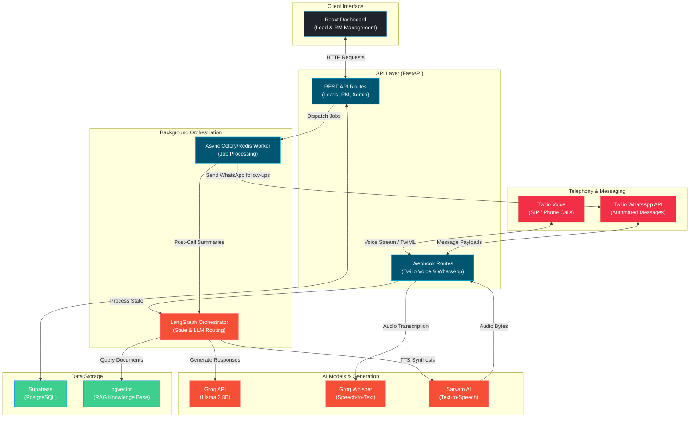

# 🎙️ Sambhaash AI

Sambhaash AI is a premium, state-of-the-art multilingual voice and text conversational AI platform designed to automate lead generation, objection handling, and conversions. Powered by an intelligent, multilingual LLM brain, Sambhaash AI interacts with leads via phone calls and WhatsApp, answers context-specific questions from an indexed Knowledge Base (RAG pipeline), scores leads dynamically, and assigns high-intent clients directly to Relationship Managers.

---

## 🛠️ Tech Stack

Sambhaash AI leverages a modern, cutting-edge full-stack architecture to ensure low-latency, scalable, and high-fidelity multilingual interactions.

<div align="center">
  
  
  
  
  
  
  
  
  
  
  
  
  
  
  
  
  
  
  
  
</div>


## 📐 Architecture & Flowchart

The overall functional flow of Sambhaash AI covers the entire lifecycle—from the administrator uploading lead contacts to telephony engagement, RAG vector lookup, lead scoring, automated WhatsApp conversational follow-ups, and Relationship Manager allocation.


### System Architecture Workflow



---

## 🌟 Key Features

### 1. Unified Lead Administration Dashboard
* **Dynamic Lead Insertion:** Upload bulk lead contacts via standard `.csv` files or add single hot prospects directly using interactive frontend modals.
* **Lead Tracking & Filtering:** Segment lead queues based on Call Status, Language preference, Dynamic Lead Scores, and assigned Relationship Managers.

### 2. High-Fidelity Multilingual Speech Engine
* **Supports 10 Major Indian Languages:** Complete support for English, Hindi, Tamil, Telugu, Kannada, Malayalam, Bengali, Marathi, Gujarati, and Punjabi.
* **Whisper Large V3 (Groq API):** Transcribes user responses on phone calls with sub-second latency.
* **BulBul V3 (Sarvam.ai API):** Generates high-fidelity, natural-sounding multilingual audio output for automated voice interaction.

### 3. Dynamic RAG Vector Database
* Uses **Hugging Face (`all-MiniLM-L6-v2`)** to create semantic embeddings of uploaded appendixes, documents, and objection handling guidelines.
* Stores chunks in PostgreSQL via **`pgvector`** for rapid contextual retrieval during live call sessions.

### 4. Intelligent Lead Segregation & Engagement
* **HOT Leads (🔥):** Automatically routed to the RM Desk. Administrators can assign them to dedicated agents (Rajesh, Priya, Amit, Sneha) and mark them as converted with custom interaction notes.
* **WARM Leads (🟡):** Queued up for an automatic personalized initial WhatsApp message in their preferred language. If the lead replies, our Groq Llama 3.3 agent answers contextually in their same language.
* **COLD Leads (❄️):** Logged inside the standard call history dashboard.

### 5. Premium Real-Time Analytics
* Monitor total call stats, AI response accuracy (average relevance scores), and knowledge-base query counts.
* **Top Knowledge Assets:** Custom charts displaying document utility by dynamically matching active uploads (like custom files and Appendixes) with positive count feedback.

---

## 🚀 Development Setup Guide

### 📂 Frontend Setup

1. Navigate to the Frontend workspace:
   ```bash
   cd Frontend
   ```
2. Create your `.env` file using the template below:
   ```bash
   cp .env.example .env
   ```

#### `Frontend/.env.example`
```env
VITE_API_BASE_URL_DEV=http://127.0.0.1:8000
VITE_API_BASE_URL_PRO=https://your-production-api-domain.com
MODE=development

# Supabase Client Configurations
VITE_SUPABASE_URL=https://your-supabase-project.supabase.co
VITE_SUPABASE_ANON_KEY=your-supabase-anon-public-key
```

3. Install dependencies and start the development server:
   ```bash
   npm install
   npm run dev
   ```

---

### 🐍 Backend Setup

1. Navigate to the Backend workspace:
   ```bash
   cd Backend
   ```
2. Initialize and activate a Python virtual environment:
   ```bash
   python -m venv venv
   source venv/Scripts/activate # On Windows: venv\Scripts\activate
   ```
3. Install package requirements:
   ```bash
   pip install -r requirements.txt
   ```
4. Create your `.env` file using the template below:
   ```bash
   cp .env.example .env
   ```

#### `Backend/.env.example`
```env
# Supabase Configuration
SUPABASE_URL=https://your-project.supabase.co
SUPABASE_SERVICE_ROLE_KEY=your-key
SUPABASE_BUCKET_NAME=your_bucket_name

# Database URL
DATABASE_URL=postgresql://postgres:[password]@[host]:5432/postgres

# AI APIs
GROQ_API_KEY=gsk_xxxxxxxxxxxxxxxxxxxxx
HF_API_KEY=hf_your_hugging_face_token_here
SARVAM_API_KEY=your_sarvam_key_here

# Twilio & Telephony
TWILIO_ACCOUNT_SID=ACxxxxxxxxxxxxx
TWILIO_AUTH_TOKEN=your_auth_token_here
TWILIO_PHONE_NUMBER=+1234567890
TWILIO_WHATSAPP_FROM=whatsapp:+1234567890
TWILIO_WEBHOOK_BASE_URL=https://your-ngrok-tunnel-url.ngrok-free.app

# Optional Queue (Redis)
REDIS_URL=redis://localhost:6379

# Ngrok Setup
NGROK_AUTH_TOKEN=your_auth_token_here

# Runtime Mode
MODE=development
ENVIRONMENT=development
```

5. Start Redis (required for async task queue processing) using Docker:
   ```bash
   docker run -d --name sambhaash-redis -p 6379:6379 redis:alpine
   ```
6. Start the FastAPI API Server:
   ```bash
   python -m uvicorn main:app --reload
   ```
7. Start the Async Background Worker (processes leads scoring, CRM operations, and automated WhatsApp replies):
   ```bash
   python run_worker.py
   ```

> [!IMPORTANT]
> **⚠️ Twilio Free Tier Verification Note:**
> If you are using a Twilio Free Trial account, calls and automated WhatsApp messages will *only* be successfully received by phone numbers that have been explicitly verified inside your Twilio Console.
> 
> **How to Verify Your Testing Phone Numbers in Twilio:**
> 1. Log in to your [Twilio Console](https://www.twilio.com/console).
> 2. Navigate to **Phone Numbers** ➔ **Verified Caller IDs**.
> 3. Click the **"Add a new Caller ID"** button.
> 4. Enter your personal phone number (including country code, e.g., `+91` for India).
> 5. Choose your preferred verification method:
>    * **SMS:** Enter the numeric code sent via text.
>    * **Voice Call:** Enter the code provided by the automated voice caller.
> 6. Complete the verification. Your phone number is now verified ✅ and ready to receive calls and messages from the Sambhaash AI Agent!

---

## 📡 API Endpoints Documentation

| Category | Method | Path | Description |
| :--- | :---: | :--- | :--- |
| **General** | `GET` | `/health` | Check backend service health status. |
| **Leads** | `GET` | `/api/leads` | List all leads with filters, paginated offsets, and search querying. |
| **Leads** | `POST` | `/api/leads` | Create a single lead profile contact manually. |
| **Leads** | `GET` | `/api/leads/{id}` | Retrieve profile details of a specific lead. |
| **Leads** | `PUT` | `/api/leads/{id}` | Update parameters or conversation status of a lead. |
| **Leads** | `DELETE` | `/api/leads/{id}` | Remove a lead from the database. |
| **Leads** | `POST` | `/api/leads/batch` | Bulk upload multiple leads via `.csv` file. |
| **RM Desk** | `GET` | `/api/rm/queue` | Get the list of HOT leads allocated to a Relationship Manager. |
| **RM Desk** | `POST` | `/api/rm/assign` | Manually assign a lead to a dedicated Relationship Manager. |
| **RM Desk** | `POST` | `/api/rm/convert/{id}` | Mark a lead as converted with custom conversion notes. |
| **RM Desk** | `GET` | `/api/rm/stats` | Retrieve relationship manager metrics (conversions, pendings). |
| **RM Desk** | `GET` | `/api/rm/leaderboard` | Get leaderboard rankings of active Relationship Managers. |
| **Knowledge Base** | `POST` | `/admin/kb/upload` | Upload and chunk an appendix/document, generate vector embeddings, and save to Postgres. |
| **Knowledge Base** | `GET` | `/admin/kb/documents` | List all uploaded documents with chunk counts. |
| **Knowledge Base** | `DELETE` | `/admin/kb/documents/{id}` | Remove a document and its vectorized chunks. |
| **Knowledge Base** | `GET` | `/admin/kb/search` | Search query database chunks utilizing semantic cosine-similarity matches. |
| **Analytics** | `GET` | `/admin/kb/analytics/effectiveness` | Retrieve aggregate performance statistics, average relevance scores, and top used files. |
| **Analytics** | `GET` | `/admin/kb/analytics/call/{session_id}`| Get specific document retrieval timeline logs for a particular call session. |
| **Telephony** | `POST` | `/api/calls/initiate` | Outbound trigger to call a lead phone number via Twilio Voice. |
| **Telephony** | `POST` | `/api/webhook/twilio/voice` | Twilio Voice webhook call response handler. |
| **Telephony** | `GET` | `/api/webhook/twilio/audio/{call_sid}` | Audio fetch endpoint for Twilio `<Play>` TTS. |
| **Telephony** | `POST` | `/api/webhook/twilio/status` | Twilio Status callback to handle failed calls and voicemails. |
| **WhatsApp** | `POST` | `/api/whatsapp/webhook` | Incoming Twilio webhook that handles WhatsApp conversational user interactions. |

---