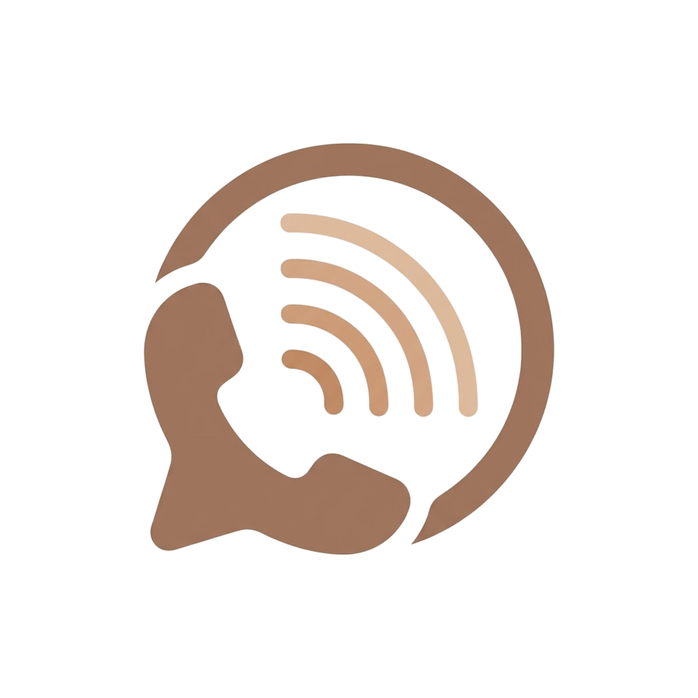
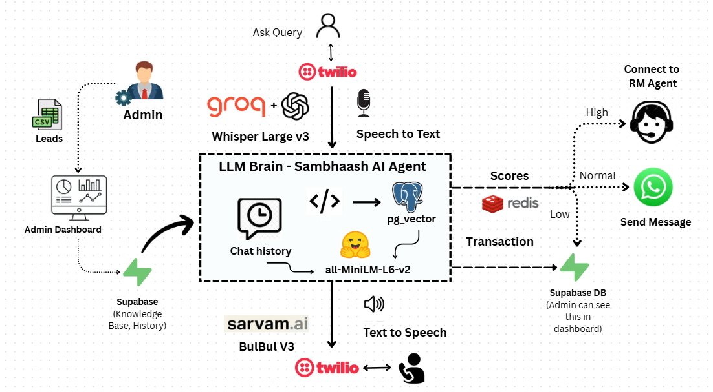
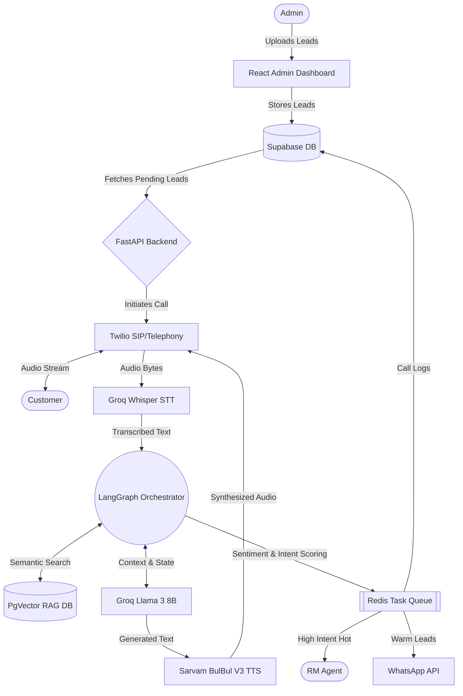
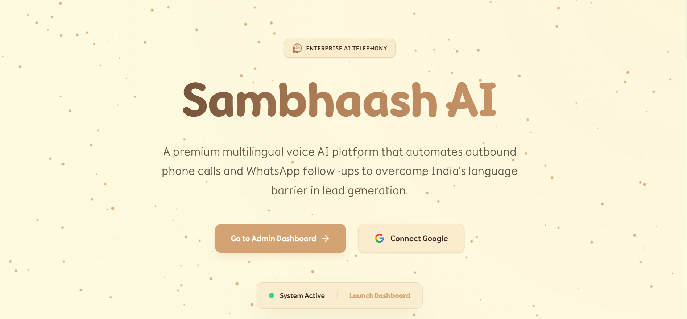
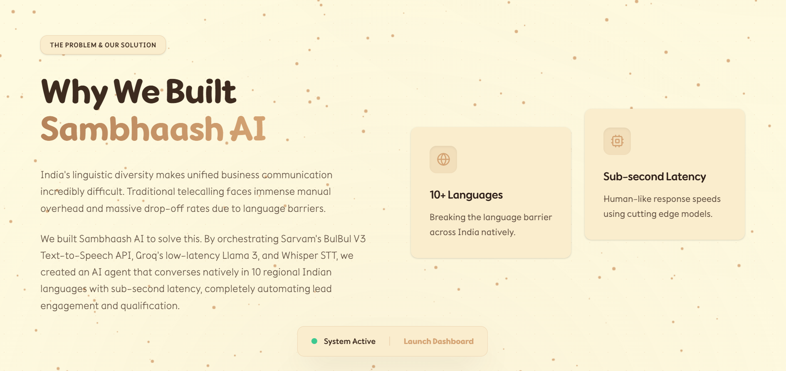
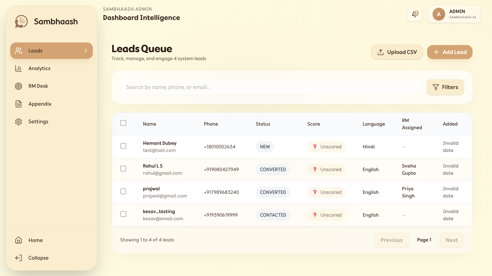
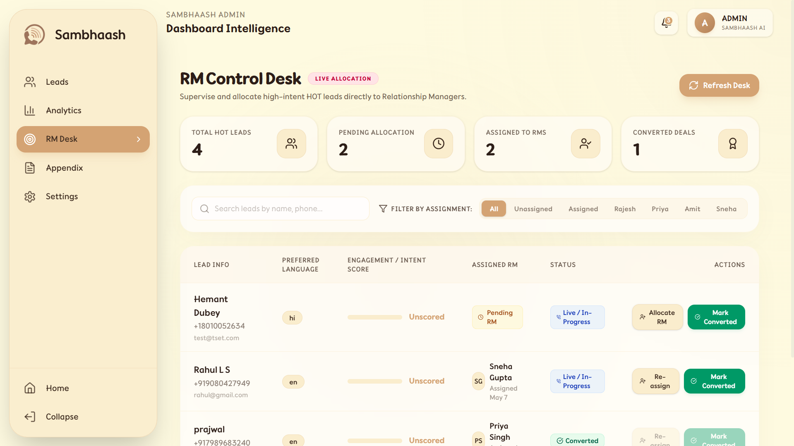

<div align="center">
  
  <h1>Sambhaash AI</h1>
  <p><strong>A Premium Multilingual Voice AI Platform for Automated Lead Generation</strong></p>
</div>

---

## Awards & Achievements

**Sambhaash AI is a winning project from the Namespace Hackathon!**
- 🥉 **3rd Place Globally (Sarvam AI Track):** Awarded $200 in Sarvam AI credits for building a high-fidelity conversational agent using BulBul V3.
- 🌍 **Top 50 Globally (Overall):** Recognized as a top 50 project worldwide, winning a $20 cash prize for excellence in the Work, Finance & Digital Economy theme.

---

## Overview

**Sambhaash AI** is an enterprise-grade multilingual voice AI platform designed to automate lead generation and overcome linguistic barriers in business outreach. Traditional telecalling operations suffer from massive manual overhead and high drop-off rates when agents cannot converse in a lead’s native tongue. 

To solve this, Sambhaash AI acts as an autonomous telephony orchestrator that seamlessly conducts outbound calls in over 10 regional Indian languages with human-like, sub-second latency, completely automating the initial engagement and qualification process. 

---

## Key Features

- **High-Fidelity Multilingual Speech Engine:** Full support for 10 major Indian languages using Sarvam BulBul V3 and Groq Whisper.
- **Dynamic RAG Knowledge Base:** Real-time semantic knowledge retrieval during live calls using Hugging Face embeddings and pgvector to handle complex client objections on the fly.
- **Intelligent Lead Routing:** Analyzes call sentiment and automatically routes "Hot" leads directly to human Relationship Managers (RMs).
- **WhatsApp Follow-up Agent:** Automatically engages "Warm" leads post-call via context-aware WhatsApp chats to nurture them toward conversion.
- **Unified Admin Dashboard:** A beautiful React-based command center to upload CSV leads, monitor real-time AI accuracy, and view call transcripts.

---

## Architecture

The overall functional flow of Sambhaash AI covers the entire lifecycle—from the administrator uploading lead contacts to telephony engagement, RAG vector lookup, lead scoring, and intelligent handoffs.

<p align="center">
  
</p>



### How It Works (The Lifecycle)

1. **Lead Ingestion & Queuing:** Administrators upload campaign lists via the React dashboard. Leads are securely stored in **Supabase**, and outreach jobs are asynchronously scheduled into a **Redis task queue** to prevent bottlenecks.
2. **Telephony & Real-Time STT:** When a call connects via **Twilio SIP**, the live bidirectional audio stream is captured. The user's speech is chunked and streamed to **Groq Whisper** for ultra-fast, sub-second Speech-to-Text (STT) transcription.
3. **Cognitive Processing & RAG:** The transcribed text enters our **LangGraph** orchestration pipeline. Here, the system queries a **pgvector** database (using Hugging Face embeddings) to fetch relevant knowledge base articles, ensuring the AI can handle complex, domain-specific objections accurately via **Llama 3 (8B)**.
4. **Synthesis (TTS) & Action:** The generated response text is instantly synthesized into high-fidelity, emotionally resonant regional audio using **Sarvam AI (BulBul V3)** and streamed back to the user.
5. **Intelligent Handoff:** Post-call, LangGraph evaluates the entire transcript's sentiment and intent. **"Hot"** leads instantly trigger a live handoff to a Relationship Manager (RM), while **"Warm"** leads are automatically nurtured via our context-aware **WhatsApp Follow-up Agent**.

---

## Tech Stack

### Frontend  
  

### Backend  
   

### Database  
   

### APIs & AI Models  
     

### Hosting & DevOps  
  

---

## Platform Previews

<div align="center">
  
  <br /><br />
  
  <br /><br />
  
  <br /><br />
  
</div>

---

## Local Setup

### Requirements:
- Node.js & npm
- Python 3.9+ & pip
- Docker (for Redis)
- API Keys: Supabase, Groq, Hugging Face, Sarvam, Twilio, Ngrok

### Setup Instructions:
```bash
# 1. Frontend Setup
cd Frontend
cp .env.example .env # Configure environment variables
npm install
npm run dev

# 2. Backend Setup
cd ../Backend
python -m venv venv
source venv/Scripts/activate # On Windows: venv\Scripts\activate
pip install -r requirements.txt
cp .env.example .env # Configure environment variables

# 3. Start Infrastructure & Workers
docker run -d --name sambhaash-redis -p 6379:6379 redis:alpine
python run_worker.py # Start async background worker

# 4. Start Backend API
python -m uvicorn main:app --reload
```

---

## Future Scope

- **More integrations:** Native integrations with standard CRM systems (Salesforce, HubSpot) to automatically update lead statuses and log call transcripts.
- **Security enhancements:** Enhanced access controls and PII redaction during LLM processing.
- **Localization / broader accessibility:** Expanding to international language models for global outreach and implementing custom voice branding/cloning.

---

## Contributors (Team TetraFourge)

- **Rahul L S** ([GitHub](https://github.com/Rahul-8283) | [LinkedIn](https://www.linkedin.com/in/rahul-ls))  
- **Kesav** ([GitHub](https://github.com/kesavvvvvv) | [LinkedIn](https://www.linkedin.com/in/kesav-satya-sai-nimmagadda-673164317))
- **Kabilan K** ([GitHub](https://github.com/KKabilan07) | [LinkedIn](https://www.linkedin.com/in/kabilank07/))
- **Prajwal Priyadarshan G** ([GitHub](https://github.com/prajwal-priyadarshan) | [LinkedIn](https://www.linkedin.com/in/prajwal-priyadarshan/))
- **Kishore B** ([GitHub](https://github.com/KishoreB25) | [LinkedIn](https://www.linkedin.com/in/kishore-b-245a66343))

---

<div align="center">
  <p>Built by Team TetraFourge for the Namespace Hackathon (Sarvam AI Track)</p>
</div>